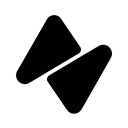

  

<h1 align="center">Nocturne Wallet</h1>

  <strong>Privacy-first browser wallet for the Midnight Network</strong>

  
  
  
  
  

  <a href="https://chromewebstore.google.com/detail/nocturne/ijfdfgajlffijenjneoppbfnhjkdibna">Chrome Web Store</a> •
  <a href="https://nocturne.cash">Website</a> •
  <a href="https://docs.midnight.network">Midnight Docs</a> •
  <a href="#getting-started">Get Started</a>

---

This project integrates with the Midnight Network.

> A self-custodial browser extension wallet for the [Midnight Network](https://midnight.network/) — privacy-preserving blockchain powered by zero-knowledge proofs.

## Features

| | Feature | Description |
|---|---|---|
| 🔐 | **Zero-Knowledge Privacy** | Shielded transactions using zk-proofs — balances and amounts stay private |
| 💰 | **Multi-Token Support** | NIGHT, DUST, and custom tokens with real-time USD pricing via CoinGecko |
| 🛡️ | **Self-Custodial** | Your keys, your crypto — BIP-39 HD wallet with AES-256-GCM encryption |
| 🌐 | **Multi-Network** | Mainnet, Testnet, Preprod, and custom network endpoints |
| 🔗 | **dApp Connector** | Connect securely to Midnight dApps with permission management |
| 👥 | **Multiple Accounts** | Create or import multiple accounts under one wallet |

---

## Getting Started

### Create a New Wallet

1. Install the Nocturne extension from the [Chrome Web Store](https://chromewebstore.google.com/detail/nocturne/ijfdfgajlffijenjneoppbfnhjkdibna)
2. Click **Create New Wallet**
3. Set a strong password (used to unlock the wallet)
4. **Write down your 24-word recovery phrase** on paper and store it safely — this is the only way to recover your wallet if you lose access
5. Confirm the recovery phrase to complete setup

### Import an Existing Wallet

If you already have a Midnight wallet:

1. Click **Import Wallet**
2. Enter your 24-word recovery phrase
3. Set a new password
4. Your accounts and balances will sync automatically

---

## Dashboard

The home screen shows your wallet overview at a glance:

- **Total balance** in USD across all token types (powered by CoinGecko)
- **Token list** with shielded and unshielded balance breakdown — tap any token to see details
- **Quick actions** — Send, Receive, Swap, and DUST registration
- **Sync status** — indicator showing blockchain sync progress

---

## Sending Tokens

Nocturne uses a multi-step process with zero-knowledge proofs to protect your privacy:

1. Tap **Send** and choose the token type
2. Enter the recipient address (or pick from your Address Book)
3. Enter the amount
4. Review the transaction summary
5. **Build** — the wallet prepares the transaction
6. **Prove** — a zero-knowledge proof is generated (this may take a moment)
7. **Submit** — the proven transaction is sent to the network

You can cancel at any step before submission.

---

## Receiving Tokens

Tap **Receive** to display your wallet addresses. Nocturne supports three address types:

| Address Type | Use Case |
|---|---|
| **Shielded** | Private transactions — balances hidden from public view |
| **Unshielded** | Standard transactions — visible on-chain |
| **DUST** | Receive DUST tokens for gas fees |

Each address comes with a **QR code** for easy sharing.

---

## DUST Protocol

DUST is the gas token on Midnight Network. To earn DUST passively:

### Register for DUST Generation

1. Go to **Dashboard** or **Token Details**
2. Tap **Register DUST**
3. Your available NIGHT UTXOs will be registered
4. Build, prove, and submit the registration transaction
5. Once confirmed, you start receiving DUST rewards

### Deregister from DUST

1. Go to **Token Details**
2. Tap **Deregister DUST**
3. Confirm and submit the deregistration transaction

---

## Account Management

### Multiple Accounts

Nocturne supports multiple accounts under one wallet:

- **Create Account** — derives a new account from your wallet seed (HD derivation)
- **Import Account** — add an account using a separate mnemonic phrase
- **Switch Accounts** — tap the account selector at the top to switch between accounts
- **Rename Account** — customize account names for easy identification
- **Delete Account** — remove individual accounts (primary account cannot be deleted)

### Security

- **View Recovery Phrase** — requires password verification
- **Export Private Key** — requires password verification
- **Factory Reset** — wipe all wallet data and start fresh (requires password)

---

## Activity

The **Activity** tab shows your transaction history, grouped by date. Tap any transaction to view details including:

- Transaction type (send, receive, DUST registration)
- Amount and token type
- Transaction hash
- Status (pending, confirmed, failed)

---

## Settings

### Network Settings

Nocturne supports multiple Midnight networks:

| Network | Description | Status |
|---|---|---|
| **Mainnet** | Midnight main network | 🔒 Coming soon |
| **Testnet** | Midnight test network | ✅ Available |
| **Preprod** | Pre-production network | ✅ Available |
| **Custom** | Manual endpoint configuration | ✅ Available |

To switch networks: **Settings > Active Networks** > select your network > confirm.

> **Note:** Switching networks will lock your wallet and restart synchronization. Your balances will update to reflect the selected network.

### Connected Apps

View and manage dApps connected to your wallet. Revoke access to any connected application from **Settings > Connected Apps**.

---

## Resync Wallet

If your balances appear incorrect or sync seems stuck:

1. Go to **Settings**
2. Tap **Resync Wallet**
3. Enter your password to confirm
4. The wallet will perform a full blockchain resync

---

## Security Best Practices

- **Never share your recovery phrase** with anyone
- **Never enter your recovery phrase** on any website
- **Use a strong, unique password** for your wallet
- **Lock your wallet** when not in use (the wallet auto-locks after inactivity)
- **Verify addresses carefully** before sending transactions
- **Keep your browser and extension updated**

---

## Auto-Lock

For security, Nocturne automatically locks after a period of inactivity. You'll need to enter your password to unlock and resume using the wallet.

---

## FAQ

**Q: What happens if I lose my password?**
A: You can reinstall the extension and import your wallet using your 24-word recovery phrase. Set a new password during import.

**Q: What happens if I lose my recovery phrase?**
A: Without the recovery phrase, there is no way to recover your wallet. Always keep a secure backup.

**Q: Are my transactions private?**
A: Shielded transactions use zero-knowledge proofs to hide balances and amounts. Unshielded transactions are visible on-chain.

**Q: Why does "Prove" take time?**
A: Zero-knowledge proof generation is computationally intensive. This is what ensures your transaction privacy on the Midnight Network.

**Q: Can I use Nocturne on multiple browsers?**
A: Yes. Import your wallet using the same recovery phrase on each browser. Accounts and balances will sync independently.

---

## Tech Stack

  
  
  
  
  
  

---

## Support

- **Chrome Web Store**: [Install Nocturne](https://chromewebstore.google.com/detail/nocturne/ijfdfgajlffijenjneoppbfnhjkdibna)
- **Website**: [nocturne.cash](https://nocturne.cash)
- **Midnight Network**: [midnight.network](https://midnight.network)
- **Documentation**: [docs.midnight.network](https://docs.midnight.network)

---

  Built with ❤️ by <a href="https://htlabs.xyz">HTLabs</a> for the Midnight ecosystem

